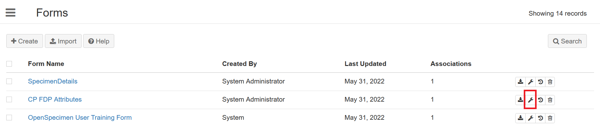
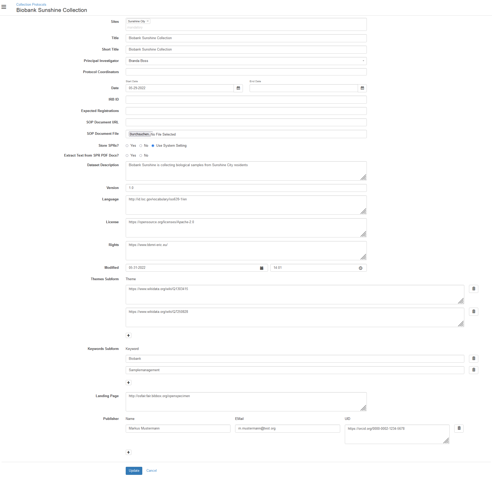
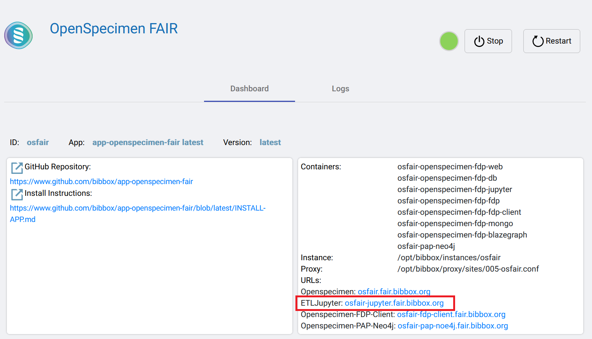
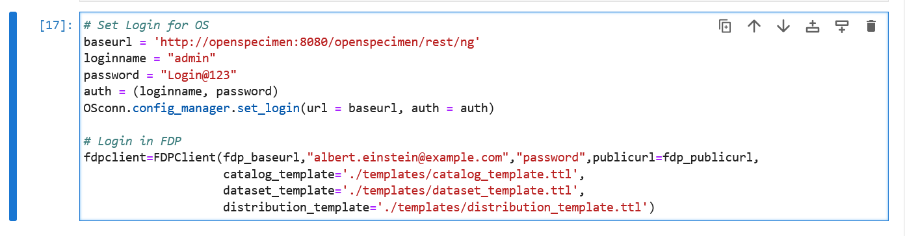
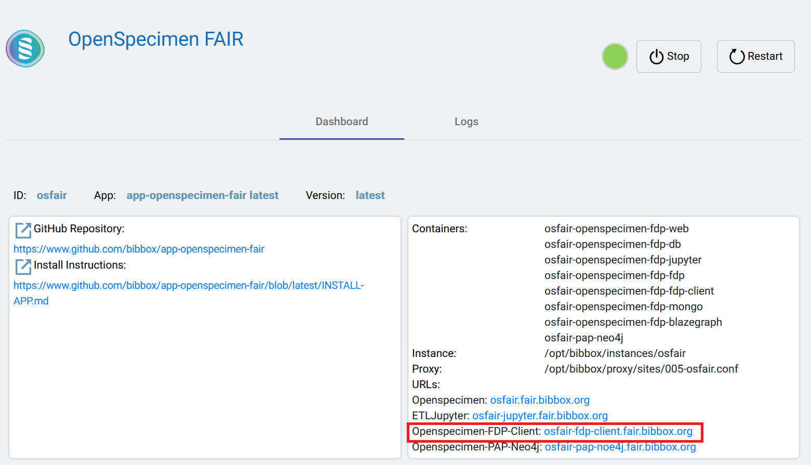
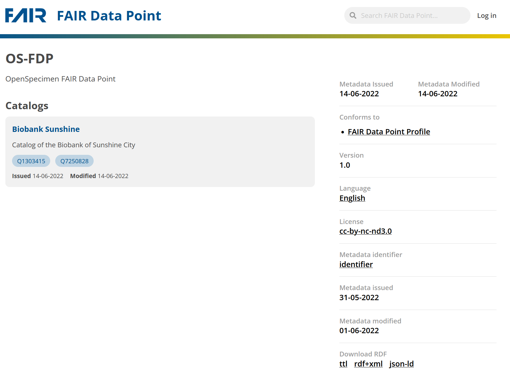
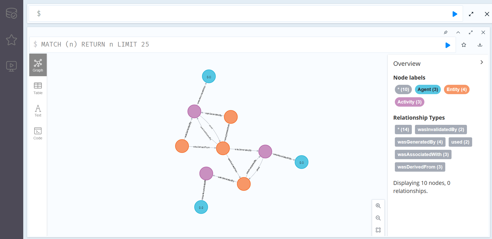

## OpenSpecimen & FAIR Data Point Setup Instructions 

### Start OpenSpecimen

* Install the application from FAIR Toolbox store
* Wait for installation to finish
* After installation in FAIR Toolbox, Open Specimen will take some minutes to set up internally
* Start the application from FAIR Toolbox application screen
* Log into Open Specimen with default admin user "admin" and password "Login@123"

### Log in with the default credentials 
The default admin user name is "admin". The default admin password is "admin".

* After logging into the application, the user will have access to the Open Specimen dashboard and the application is ready to use
* Don't forget to change the default access credentials!
* See the [OpenSpecimen Manual](https://openspecimen.atlassian.net/wiki/spaces/CAT/pages/7700605/User+Manual+Community+Edition) for more information

#### FAIRification
Follow these steps to make the app FAIR (**F**indable, **A**ccessible, **I**nteroperable and **R**eusable).

The FAIR Data Point will take the required information from the collection protocols as well as specifically designed forms:
1) upload the FDP form (data/openspecimen_fdp_form/cp_fdp_attributes.xml) to Openspecimen. 
   1) In OpenSpecimen, use the Menu bar to navigate to the Forms page
   2) Here, click import and select the cp_fdp_attributes.xml file. The imported form will open, click "done" at the buttom of the page.
   3) After importing, we have to tell OpenSpecimen where we would like to attach this form to.  Click on the wrench icon next to the form. 
   4) Select "Collection Protocol Custom Fields" in the next window and attach the form to all present and future collection protocols. 
2) When you now create a new **collection protocol** or edit an already existing one, you can enter the FDP required information at the bottom  

#### Set up FAIR Data Point.

Open Jupyter via the app dashboard or by changing the subdomain of the url to `<instancename>-jupyter`:

Access Token is: FDP
1) Open jupyter notebook (/work/fillFDP.ipynb) 
    
2) set User credentials for the FAIR Data Point and OpenSpecimen
FDP default credentials: EMail "albert.einstein@example.com", Password: "password"
OpenSpecimen default credentials: user: "admin", password: "Login@123"

3) Execute the jupyter notebook by clicking the fast forward symbol (&#9193;) at the top. Make sure, that all collection protocols have the FDP form attached and the attributes are set. 

4) Open the FDP client to view the result, either via the dashboard or by changing the subdomain of the url to `<instancename>-fdp-client`

Browsing data is possible without login! 

#### Set up Provenance Access Point
Open the Neo4j Browser, either via the app dashboard of by changing the subdomain of the url to `<instancename>-pap-noe4j`
Login with username: "neo4j", password: "neo4j". You will be asked to set a new password, remember it!

Open Jupyter via the app dashboard or by changing the subdomain of the url to `<instancename>-jupyter`:

Access Token is: FDP
1) Open jupyter notebook (/work/fillPAP.ipynb) 
    
2) set User credentials for the Neo4j databaset and OpenSpecimen
Neo4j password has been set by the user earlier!
OpenSpecimen default credentials: user: "admin", password: "Login@123"

3) Execute the jupyter notebook by clicking the fast forward symbol (&#9193;) at the top. The script will iterate through all collection protocols and all patients and add the provenance information for each specimen to the Neo4j databaset 

4) Open the Neo4j Browser and log in to view the result

